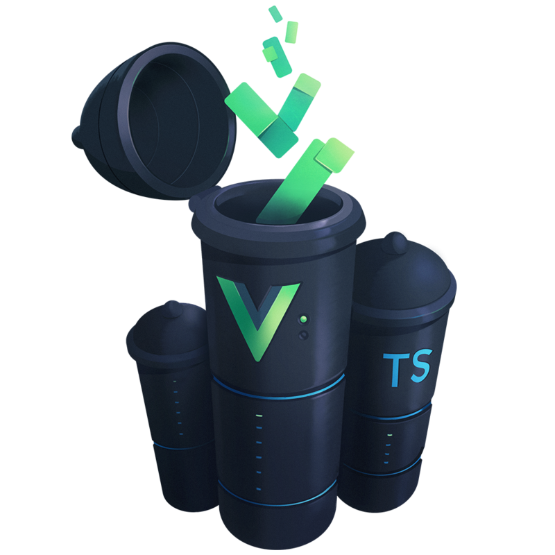

# Vuex? 和 TypeScript 的 Webpack4.+ 尝鲜



>静态类型系统能帮助你有效防止许多潜在的运行时错误，而且随着你的应用日渐丰满会更加显著。这就是为什么 Vue 不仅仅为 Vue core 提供了针对 TypeScript 的官方类型声明，还为 Vue Router 和 Vuex 也提供了相应的声明文件

## TsConfig配置

```js
{
    "compilerOptions": {
      // ts 文件编译成 js 文件的时候，同时生成对应的 map 文件
      "sourceMap": true,
      "strict": true,
      "strictNullChecks": true,
      // 当表达式和申明 类型为any时，是否需要发出警告，设置true，则不警告
      "noImplicitAny": true,
      // 设置为true时，如果不是函数中的所有路径都有返回值，则提示Error
      "noImplicitReturns": true,
      // module 用于指定模块的代码生成规则，可以使用 commonjs 、 amd 、 umd 、 system 、 es6 、 es2015 、 none 这些选项。
      // 选择commonJS，会生成符合commonjs规范的文件，使用amd，会生成满足amd规范的文件，使用system会生成使用ES6的
      // system.import的代码。使用es6或者是es2015会生产包含ES6特性的代码。
      "module": "es2015",
      "moduleResolution": "node",
      // 设置为true时，则允许从没有默认导出的模块中默认导入(也就是不做检查)
      "allowSyntheticDefaultImports": true,
      // 设置为true，则支持ES7的装饰器特性
      "experimentalDecorators": true,
      // target 用于指定生成代码的兼容版本，可以从es3,es5,es2015,es6中选择一个，如果不设置，默认生产的代码兼容到es3
      "target": "es5"
    },
    "include": [
        "./src/**/*"
    ]
}
```
配置参考： 
- [官方文档tsconfig解析](https://www.typescriptlang.org/docs/handbook/tsconfig-json.html) 
- [tsconfig的JSON文档](http://json.schemastore.org/tsconfig)

## Webpack的基础配置一览

每个项目最重要的一部分个人感觉是webpack的配置，只有配置好webpack部分后续才能顺利进行开发

这里webpack使用了4.+的版本，所以算是体验了较为新的webpack，其中和旧版的有些区别，这里不做介绍

先贴出webpack的配置代码

```js
const path = require('path')
const webpack = require('webpack')
const VueLoaderPlugin = require('vue-loader/lib/plugin')

module.exports = {
  mode: process.env.NODE_ENV === 'production' ? 'production' : 'development',
  entry: './src/index.ts',
  output: {
    path: path.resolve(__dirname, './dist'),
    publicPath: '/dist/',
    filename: 'build.js'
  },
  module: {
    rules: [
      {
        test: /\.vue$/,
        loader: 'vue-loader',
        options: {
          loaders: {
            'scss': 'vue-style-loader!css-loader!sass-loader',
            'sass': 'vue-style-loader!css-loader!sass-loader?indentedSyntax',
          }
        }
      },
      {
        test: /\.tsx?$/,
        loader: 'ts-loader',
        exclude: /node_modules/,
        options: {
          transpileOnly: true,
          appendTsSuffixTo: [/.vue$/]
        }
      }
    ]
  },
  resolve: {
    extensions: ['.ts', '.js', '.vue', '.josn'],
    alias: {
      'vue$': 'vue/dist/vue.esm.js'
    }
  },
  devServer: {
    contentBase: './public',
    host: 'localhost',
    port: '8080',
    open: true,
    hot: true,
    inline: true,
    historyApiFallback: true,
    noInfo: true
  },
  performance: {
    hints: false
  },
  devtool: '#eval-source-map',
  plugins: [
    new VueLoaderPlugin()
  ]
}

if (process.env.NODE_ENV === 'production') {
  module.exports.devtool = '#source-map'
  module.exports.plugins = (module.exports.plugins || []).concat([
    new webpack.DefinePlugin({
      'process.env': {
        NODE_ENV: '"production"'
      }
    }),
    new webpack.optimize.UglifyJsPlugin({
      sourceMap: true,
      compress: {
        warnings: false
      }
    }),
    new webpack.LoaderOptionsPlugin({
      minimize: true
    })
  ])
} else {
  module.exports.plugins = (module.exports.plugins || []).concat([
    new webpack.HotModuleReplacementPlugin()
  ])
}

```

注意点：

- vue-loader v15需要在webpack插件中添加VueLoaderPlugin插件

- webpack4.+需要指定mode，开发模式还是生产模式

- 注意ts-loader的配置

这里只是简单进行webpack配置，没有太完整地根据完整的项目来进行配置，只是简单配置了生产环境下的代码混淆压缩，以及对应的开发服务器和热更新等，有需要其他功能扩展的自行配置。

## Vue环境搭建配置

### vue-shims.d.ts的添加

这个是比较重要的一个配置，该文件需要放到vue的入口文件中，具体的d.ts代码如下：

```ts
declare module '*.vue' {
  import Vue from 'vue'
  export default Vue
}
```

目的是让ts能够识别到vue的静态类型

### vue的入口文件

index.ts:

```ts
import Vue from 'vue'
import App from './App.vue'
// vuex部分
import store from './store'

new Vue({
  el: '#app',
  store,
  render: h => h(App),
})

```

入口文件跟普通的js写法没有太多的区别，只是文件类型为ts。

## 开始写vue的单文件页面和组件

### 单文件页面模板

```js
<template>
  ...
</template>

<script lang="ts">
  ...
</script>

<style>
  ...
</style>
```

主要是在script项中把lang写为ts类型

### 使用装饰器来实现组件和页面

这里我们主要使用两个装饰器库vue-property-decorator 和 vuex-class, vue-property-decorator其是基于vue-class-得component的基础扩展修改的。

1. 大致了解一下vue-property-decorator的装饰器的用法

一共有七个装饰器：
* `@Emit`
* `@Inject`
* `@Model`
* `@Prop`
* `@Provide`
* `@Watch`
* `@Component` (**exported from** `vue-class-component`)

这里使用vue-property-decorator的例子来做解析

```ts
import { Component, Emit, Inject, Model, Prop, Provide, Vue, Watch } from 'vue-property-decorator'

const s = Symbol('baz')

@Component
export class MyComponent extends Vue {
  
  @Emit()
  addToCount(n: number){ this.count += n }

  @Emit('reset')
  resetCount(){ this.count = 0 }

  @Inject() foo: string
  @Inject('bar') bar: string
  @Inject({from: 'optional', default: 'default'}) optional: string
  @Inject(s) baz: string

  @Model('change') checked: boolean

  @Prop()
  propA: number

  @Prop({ default: 'default value' })
  propB: string

  @Prop([String, Boolean])
  propC: string | boolean

  @Provide() foo = 'foo'
  @Provide('bar') baz = 'bar'

  @Watch('child')
  onChildChanged(val: string, oldVal: string) { }

  @Watch('person', { immediate: true, deep: true })
  onPersonChanged(val: Person, oldVal: Person) { }
}

```

相当于js的写法：

```js
const s = Symbol('baz')

export const MyComponent = Vue.extend({
  name: 'MyComponent',
  inject: {
    foo: 'foo',
    bar: 'bar',
    'optional': { from: 'optional', default: 'default' },
    [s]: s
  },
  model: {
    prop: 'checked',
    event: 'change'
  },
  props: {
    checked: Boolean,
    propA: Number,
    propB: {
      type: String,
      default: 'default value'
    },
    propC: [String, Boolean],
  },
  data () {
    return {
      foo: 'foo',
      baz: 'bar'
    }
  },
  provide () {
    return {
      foo: this.foo,
      bar: this.baz
    }
  },
  methods: {
    addToCount(n){
      this.count += n
      this.$emit("add-to-count", n)
    },
    resetCount(){
      this.count = 0
      this.$emit("reset")
    },
    onChildChanged(val, oldVal) { },
    onPersonChanged(val, oldVal) { }
  },
  watch: {
    'child': {
      handler: 'onChildChanged',
      immediate: false,
      deep: false
    },
    'person': {
      handler: 'onPersonChanged',
      immediate: true,
      deep: true
    }
  }
})
```

相信通过以上的例子我们很容易就看出各个装饰器如何去使用，这里就不再做太多的解释。


2. 再看一下vuex-class的使用方法

同样举例官方的使用列子

```js
import Vue from 'vue'
import Component from 'vue-class-component'
import {
  State,
  Getter,
  Action,
  Mutation,
  namespace
} from 'vuex-class'

const someModule = namespace('path/to/module')

@Component
export class MyComp extends Vue {
  @State('foo') stateFoo
  @State(state => state.bar) stateBar
  @Getter('foo') getterFoo
  @Action('foo') actionFoo
  @Mutation('foo') mutationFoo
  @someModule.Getter('foo') moduleGetterFoo

  @State foo
  @Getter bar
  @Action baz
  @Mutation qux

  created () {
    this.stateFoo // -> store.state.foo
    this.stateBar // -> store.state.bar
    this.getterFoo // -> store.getters.foo
    this.actionFoo({ value: true }) // -> store.dispatch('foo', { value: true })
    this.mutationFoo({ value: true }) // -> store.commit('foo', { value: true })
    this.moduleGetterFoo // -> store.getters['path/to/module/foo']
  }
}
```

## Vuex的配置

### store的入口

```ts
import Vue from 'vue'
import Vuex, { StoreOptions } from 'vuex'
import { RootState } from './modules/types'
import { profile } from './modules/profile'

Vue.use(Vuex)

const store: StoreOptions<RootState> = {
  state: {
    version: 'v1.0.0'
  },
  modules: {
    profile
  }
}

export default new Vuex.Store<RootState>(store);
```

这里RootState只是用于留空，目的是为了注入全局的store，区别于modules的状态

### vuex的modules的配置

1. 写一个全局类型声明

```ts
export interface RootState {
  version: string;
}
```

version字段就是我们刚才在RootState中定义的字段

2. 定义模板profile

profile模块的类型声明:

```ts
export interface ProfileState {
  firstName: string
  lastName: string
}
```

profile的模块实现:

```ts
import { RootState } from '../types'
import { Module } from 'vuex'
import { ProfileState } from './types'
import { GetterTree, ActionTree, MutationTree  } from 'vuex'
import axios, { AxiosPromise } from 'axios'

const state: ProfileState = {
  firstName: '',
  lastName: ''
}

const getters: GetterTree<ProfileState, RootState> = {
  firstName(state) : string {
    return state.firstName
  },
  lastName(state) : string {
    return state.lastName
  }
}

const actions: ActionTree<ProfileState, RootState> = {
  fetchName({ commit }, id: number): AxiosPromise<ProfileState> {
    console.log('action:', id)
    return axios.request({
      url: 'https://www.apiopen.top/satinCommentApi?id=27610708&page=1'
    }).then(res => {
      commit('setProfile', {
        firstName: 'lin',
        lastName: 'guangyu'
      })
      return res
    }).catch(err => {
      return err
    })
  }
}

const mutations: MutationTree<ProfileState> = {
  setProfile(state, payload: ProfileState) {
    state.firstName = payload.firstName
    state.lastName = payload.lastName
  }
}

const namespaced: boolean = true;

export const profile: Module<ProfileState, RootState> = {
  namespaced,
  state,
  getters,
  actions,
  mutations
};
```

这里我们就完成了Vuex的配置了，就可以结合装饰器对vuex进行调用，而且具有静态类型提示，十分方便。

完成了这一系列的配置我们的尝试已经完成，自己写了个简单的demo，有兴趣可以观看[github](https://github.com/lgybetter/vue-ts-template)怎么配置。